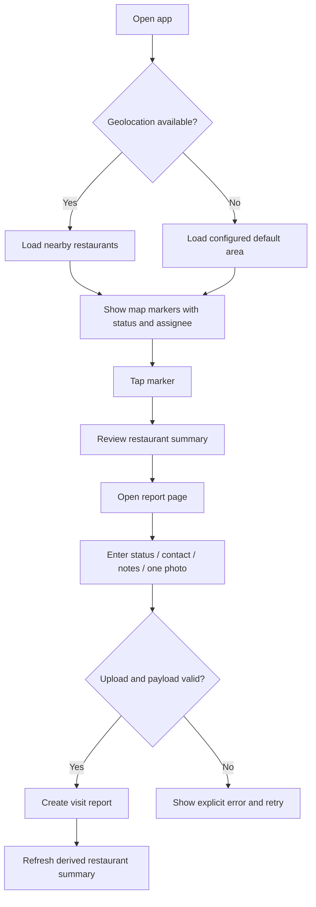
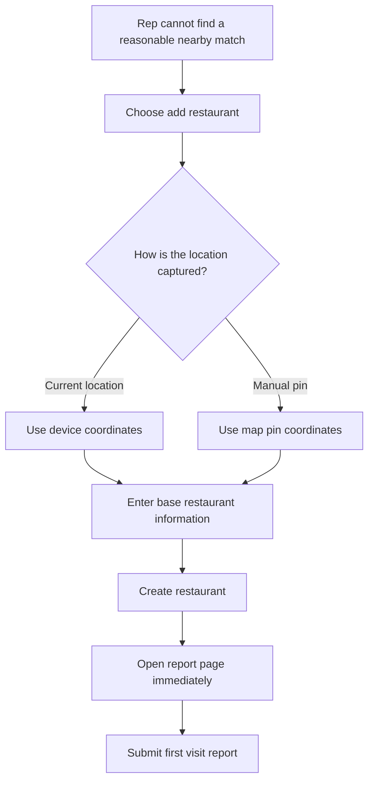
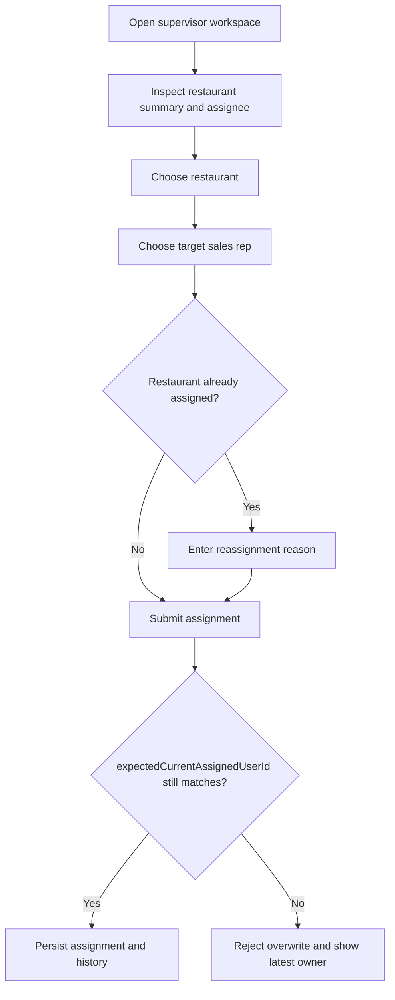
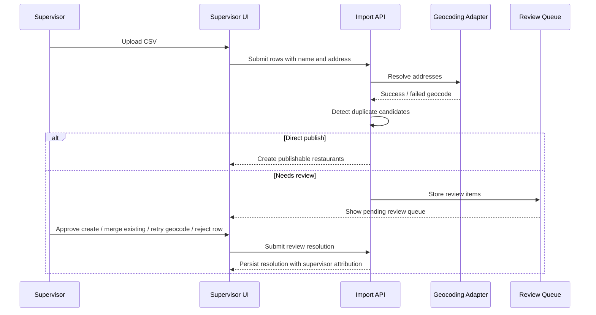

# Business Flows: PD Expansion And Operational Diagrams

## Purpose

This document expands the PRD core flows into delivery-ready business flows. The content is based on `prd.md`, `domain-rules.md`, and `technical-design-cloudflare-v0.1.md` so RD, QA, and PM can verify the same workflow assumptions without guessing.

## Validation Inputs

- Product scope and acceptance criteria: [PRD](./prd.md)
- Status, assignment, import, and media rules: [Domain Rules](./domain-rules.md)
- Delivery sequencing and Cloudflare constraints: [Technical Design v0.1](./technical-design-cloudflare-v0.1.md)

## Sales Rep Reporting Flow

### Flow Notes

- The reporting flow must still work when browser geolocation is denied by loading a deployment-configured default area.
- Marker summaries must surface current status, current owner, and latest report time before the rep enters the report page.
- A successful report updates the current restaurant summary but does not overwrite historical visit reports.

## Sales Rep New Restaurant Flow

### Flow Notes

- The creation path exists for field discovery, not bulk intake. Bulk seeding remains the CSV import workflow.
- The first report should happen in the same field session so the restaurant does not remain context-free after creation.

## Supervisor Assignment Flow

### Flow Notes

- Reassignment always requires a reason once an active owner exists.
- The system must prevent silent ownership overwrite when two supervisors act on the same restaurant.

## Supervisor Review Flow

### Flow Notes

- CSV import review is handled as part of the supervisor review workflow rather than as an unrelated standalone process.
- CSV import is the minimum bulk onboarding workflow and requires at least `name` and `address`.
- Failed geocodes and duplicate candidates must route to supervisor review instead of silently publishing questionable data.

## Cross-Role Handoffs

| Handoff                             | Source role     | Target role        | Verification checkpoint                                            |
| ----------------------------------- | --------------- | ------------------ | ------------------------------------------------------------------ |
| Field report submitted              | Sales rep       | Supervisor         | Latest activity and current owner are visible in supervisor review |
| New restaurant created in the field | Sales rep       | Supervisor         | The created restaurant appears on the map with saved coordinates   |
| Reassignment requested              | Supervisor      | System audit trail | Previous owner, new owner, actor, timestamp, and reason are stored |
| CSV row needs review                | Import pipeline | Supervisor         | Review queue shows pending item with enough context to resolve     |
